# System Architecture — Quorum AI Accountability Engine

## 1. Overview

Quorum is a full-stack Node.js/Express + React application built around two core design commitments: **deterministic logic stays deterministic** (only the parts of the system that genuinely need judgment call into the Gemini API — scheduling, urgency, and time itself are pure functions, not model outputs), and **every functional concern is isolated into its own contract-bound module**, so a failure or unexpected model response in one part of the system cannot corrupt another.

The system is organized around four cooperating agents — **Planner**, **Scheduler**, **Accountability**, and **Insight** — plus a lightweight **Coach** layer for conversational interaction, all coordinated through a single, centrally-resolved notion of time.

---

## 2. Architecture Diagram

```mermaid
flowchart TB
    subgraph Client["Frontend (React + Tailwind)"]
        TaskEntry["Task Creation Modal\n(3-step wizard)"]
        Calendar["Calendar View\n(week / day)"]
        Sidebar["Sidebar\n(Selected Day / Global Urgency tabs)"]
        Coach["Coach / Companion Drawer"]
        Insights["Insight Card"]
        DevControls["Hidden Developer Controls\n(Time-Warp)"]
    end

    subgraph Server["Backend (Node.js + Express)"]
        Middleware["Context Injection Middleware\n(profile -> every agent call)"]
        Planner["Planner Agent\nDecompositionEngine.ts"]
        Validator["DAG Validator\n(cycle check, duration bounds)"]
        Scheduler["Scheduler Agent\nDeterministicScheduler.ts"]
        Urgency["Urgency Engine\n(pure scoring function)"]
        Accountability["Accountability Agent\nAccountabilityEngine.ts"]
        Tax["Procrastination Tax\nApplication Layer"]
        CoachEngine["Coach Engine\ncoachRoutes.ts"]
        InsightAgent["Insight Agent\n(mocked -> real, on usage data)"]
        NotifEngine["Notification Decision Engine"]
        Clock["Virtual Clock\n(single source of truth for time)"]
        Identity["Identity Module\n(local UUID today, swappable for real auth)"]
    end

    subgraph External["External Services"]
        Gemini["Google Gemini API\n(structured JSON output)"]
        Firestore["Firebase Firestore"]
        LocalFallback["Local disk fallback\n(pre-Firestore-setup only)"]
        CalendarAPI["Google Calendar API\n(Phase 2 — not yet wired)"]
        CloudScheduler["Cloud Scheduler\n(Phase 2 target for push-based checks)"]
    end

    TaskEntry --> Planner
    Planner --> Gemini
    Planner --> Validator
    Validator --> Scheduler
    Scheduler --> Urgency
    Scheduler --> Firestore
    Calendar --> Scheduler
    Sidebar --> Urgency

    Accountability --> Clock
    Accountability --> Tax
    Tax --> Gemini
    Accountability --> NotifEngine

    Coach --> CoachEngine
    CoachEngine --> Gemini

    Insights --> InsightAgent
    InsightAgent --> Firestore

    DevControls -.->|gated, dev accounts only| Clock

    Middleware --> Planner
    Middleware --> CoachEngine
    Middleware --> Accountability

    Identity --> Firestore
    Firestore -.fallback.-> LocalFallback

    Scheduler -.Phase 2.-> CalendarAPI
    Accountability -.Phase 2.-> CloudScheduler
```



---

## 3. Core Design Principles

1. **Time has exactly one source of truth.** Every grace-period check, urgency calculation, and scheduling decision reads from a single `VirtualClock` module (`virtualTime = realTime + offset`, offset defaulting to `0`). No other file in the scheduling or accountability path is permitted to call `Date.now()` or `new Date()` directly. This is what makes the Time-Warp developer control safe: it changes one offset value, and every downstream calculation — already reading from that one function — simply reflects the new time. There is no separate "demo logic" anywhere in the system.

2. **Deterministic logic stays deterministic.** Scheduling placement and urgency scoring are pure functions over known inputs — they don't call Gemini. This keeps them fast, free, testable in isolation, and fully explainable (a judge can be shown exactly why a task ranked where it did). The Gemini API is reserved for the two places that genuinely require judgment: decomposing an ambiguous goal into structured subtasks, and evaluating the validity of a free-text excuse.

3. **Modules are isolated by contract, not just by convention.** Each agent is a self-contained directory with a defined request/response shape. A module only reads and writes its own Firestore collections directly; anything another module needs from it goes through that module's exposed interface, never a shared mutable state object. Practical effect: a malformed Gemini response inside the Planner can't corrupt Accountability's state, and a future module (a real Insight Agent, a real Identity/Auth module) is a new contract-bound folder, not a rewrite of existing ones.

---

## 4. Module Breakdown

| Module | Responsibility | Calls Gemini? |
|---|---|---|
| **Planner Agent** (`server/agents/planner/`) | Decomposes a task description into a dependency-aware DAG of subtasks; classifies the task as `execution` vs `learning_goal` from the description alone, in the same call | Yes |
| **DAG Validator** (`server/agents/planner/DAGValidator.ts`) | Structural validation of the Planner's output: cycle detection, dangling-dependency checks, duration-sum-vs-deadline sanity | No |
| **Scheduler Agent** (`server/agents/scheduler/`) | Pure-function placement of validated subtasks onto the calendar, respecting focus-hour preferences and blocked time | No |
| **Urgency Engine** (`server/agents/scheduler/UrgencyEngine.ts`) | Deterministic scoring of every open subtask, recomputed fresh on every read (never persisted, since it depends on virtual time) | No |
| **Accountability Agent** (`server/agents/accountability/`) | Detects missed soft deadlines against the virtual clock; evaluates user-submitted excuses and applies the resulting Procrastination Tax | Yes (excuse evaluation only — detection itself is pure logic) |
| **Coach Engine** (`server/agents/coach/`) | Conversational layer: daily briefings, "Critique Progress," free-text chat. Lower-cost quick actions (e.g. a generic nudge) are served from pre-written tone-matched templates rather than a fresh model call | Yes, selectively |
| **Insight Agent** (`server/agents/insights/`) | Surfaces behavioral patterns from the user's own logged completion/miss history; depth grows with usage | No (statistical, not generative) |
| **Notification Decision Engine** (`server/agents/notifications/`) | Rule-based evaluation of what, if anything, should be surfaced to the user on each poll — grace-period alerts, upcoming-block reminders, daily summary, idle nudges — with cooldown logic to avoid recreating the notification fatigue the product is meant to solve | No |
| **Identity Module** (`server/identity/`) | Today: passthrough for a client-generated UUID. Designed so a future real-auth integration populates the same `userId` field without touching any other module | No |

---

## 5. Agentic Workflow

### Goal Decomposition (Planner)
1. User submits a task description, deadline, priority, and optional max-time constraint through the 3-step creation modal.
2. The Planner Agent sends a single Gemini call, with the user's onboarding profile (goals, self-disclosed context, tone preference) injected as system context, requesting a strict JSON-schema response containing both a `task_type` classification and the subtask DAG.
3. The DAG Validator runs: cycle check, dependency-integrity check, duration-sum-vs-deadline check. On failure, one retry prompt naming the specific defect is issued; on a second failure, the system falls back to a safe flat checklist so a malformed response never blocks the user.
4. The user sees an editable roadmap preview. On confirming the plan, a one-time recheck runs — the same structural validation always, plus an optional soft Gemini sanity check only if an edit looks semantically inconsistent (e.g. a multi-hour subtask shrunk to a few minutes).
5. The committed DAG is handed to the Scheduler.

### Scheduling
The Scheduler is a pure function: given the DAG, the user's focus-hour preference, manually-entered blocked time, and the current virtual time, it assigns each subtask a slot. No model call is involved — this keeps placement fast and lets the logic be unit-tested against fixed fixtures.

### Urgency Scoring
Recomputed on every fetch of the task list (dashboard, calendar, sidebar all read from the same computation), combining:
- **Timeline pressure** — remaining estimated work relative to remaining time-to-deadline (the dominant weight)
- **Normalized priority** — the user's 1–10 input, scaled
- **Dependency factor** — whether the subtask is currently blocking others from starting
- **Historical risk** — the user's own past miss-rate in that task's category

Scores are banded (high / moderate / low) for visual color-coding in the UI, while the underlying sort always uses the precise numeric score — color and order are driven by the same number, but serve different purposes. Exact weight values and band cutoffs are kept as named constants in `UrgencyEngine.ts` so they can be tuned without touching the scoring logic itself.

### Accountability & the Procrastination Tax
1. Each subtask carries a soft deadline plus a grace period. On read, the Accountability Agent compares this against virtual time — purely deterministic, no model call — and flags expired subtasks as missed.
2. When a user submits a reason for a missed task, that reason — along with task and profile context — goes to Gemini via a schema that returns more than a binary verdict:
   ```
   verdict: valid | invalid | conditional
   tax: none | shorten_next_block | lock_element | max_firmness
   response_message: <in the user's current tone>
   ```
3. If the excuse is judged invalid but the extension is granted anyway, the returned tax is actually applied — not just narrated. Active taxes are written to the user's profile as flags the frontend reads and visibly enforces (a shortened next focus block, a locked UI element, or a forced "Maximum Firmness" tone override).
4. Tax expiry is computed relative to an explicit `virtualMidnightTimestamp`, not a relative "+24 hours" offset — so if the virtual clock is advanced past midnight, the tax expires immediately and correctly, rather than drifting.

### Contextual Coaching
The Coach Engine generates a daily briefing once per virtual day (gated by a stored last-briefing-date check, to avoid regenerating it on every page load) and handles free-text or quick-action conversation. Generic encouragement nudges are served from tone-matched templates rather than a fresh model call each time; reasoning-heavy actions like "Critique Progress" call Gemini with the user's current task and performance state as context.

---

## 6. Virtual Time Architecture

`VirtualClock` is the single module permitted to compute `realTime + offset`. Every other module — Scheduler, Urgency Engine, Accountability — receives the resolved virtual timestamp as an input rather than computing it independently. This single-source-of-truth design is what makes the developer-only **Time-Warp** control safe to use for live demonstration: advancing the offset doesn't trigger any special "demo mode" code path, it just changes the one value every real piece of logic already reads from.

Two safeguards sit on top of this:
- **Developer gating** — Time-Warp is hidden behind an explicit, off-by-default "Enable Developer Controls" setting, invisible during normal use, and (by design intent) disabled outright once a real, externally-synced calendar connection is active for a non-developer account — since shifting virtual time against a live external calendar would desynchronize the two.
- **Virtual-day boundaries** — anything scoped to "the rest of the day" (e.g. an active Procrastination Tax) resolves against the virtual day, recalculated relative to the active offset, not the real-world clock.

---

## 7. Data Persistence & Identity Model

**Identity, currently:** a client-generated UUID, persisted in browser storage, with no sign-up or login step. Every Firestore document is keyed against this value in a plain `userId` field — structurally identical to what a real authenticated `uid` would look like, so introducing real authentication later is a matter of populating that same field from a login response, not a schema redesign.

**Persistence:** primary data lives in Firebase Firestore — a natural fit for the DAG-shaped subtask documents and for real-time updates to the calendar view. A local-disk fallback exists for development convenience when Firestore credentials aren't yet configured; this fallback is intentionally scoped to that pre-setup situation rather than as a permanent dual-write path, since silently diverging between two stores after a real Firestore connection is already active would risk data drift that's hard to notice until a read comes back inconsistent.

---

## 8. Directory Structure

```
/server
  /time/
    VirtualClock.ts            — single source of truth for time
  /identity/
    LocalIdentity.ts           — UUID passthrough today; swappable for real auth later
  /middleware/
    contextInjector.ts         — attaches user profile to every agent request
  /agents/
    planner/
      DecompositionEngine.ts   — Gemini call + task_type classification
      DAGValidator.ts          — cycle/duration/dependency validation
    scheduler/
      DeterministicScheduler.ts
      UrgencyEngine.ts
    accountability/
      AccountabilityEngine.ts  — grace-period checks, excuse evaluation, tax application
    coach/
      CoachEngine.ts
      coachRoutes.ts
    insights/
      InsightGenerator.ts
    notifications/
      NotificationDecisionEngine.ts
  /routes/
    profile.ts

/src
  /components/
    onboarding/
    dashboard/
    roadmap/
    accountability/
    developer/                — hidden Time-Warp controls
  /hooks/
    useVirtualTime.ts
  /store/
    useAppStore.ts
```

---

## 9. Gemini Output Reliability

Every structured Gemini call in the system follows the same defensive pattern:
1. Strict JSON-schema enforcement on the response.
2. A deterministic validation pass appropriate to that call (e.g. cycle/duration checks for the DAG).
3. One automatic retry, with the specific validation failure named in the retry prompt.
4. A safe, minimal fallback (e.g. a flat checklist) if the retry also fails — so a single bad model response degrades gracefully instead of breaking the user-facing flow.

---

## 10. Deployment Architecture

The application is built and deployed on **Google Cloud Run** as a containerized service — meaning the Node.js/Express backend and React frontend deploy together as a single unit, with the Gemini API key handled as a server-side secret rather than exposed to the client.

Accountability checks currently run on read (whenever the frontend polls or loads, missed-deadline detection runs against the virtual clock). The system already exposes this as a stateless HTTPS endpoint (`/api/accountability/cron-check`), structured so that swapping in an external trigger — **Cloud Scheduler** calling that same endpoint on an interval — requires no change to the underlying detection logic, only a change in what invokes it.

---

## 11. Scalability & Extensibility

Because every agent is a contract-bound module owning its own data, two kinds of growth are cheap by design:
- **Replacing a mocked component** (the Insight Agent's depth, or the Identity module's auth backend) means rewriting the inside of one module — its external contract doesn't change, so nothing that calls it needs to change either.
- **Adding a new agent** means adding a new directory with its own contract, not modifying the control flow of existing ones.
